# ?? BusRadar — Real-Time Public Transport Tracking System
> **Team LogiCode | Smart India Hackathon (SIH) MVP Prototype**  
> *Low-cost, crowd-sourced & driver-assisted real-time transit intelligence for Tier-2 and Tier-3 Indian cities (Pilot: Yamuna Nagar, Haryana)*

---


---

## ?? 1. Project Overview & Mission

### The Problem
Public transit in Tier-2 and Tier-3 Indian cities (such as Yamuna Nagar, Ambala, and Kurukshetra) is plagued by unpredictability. State transport and private bus fleets rarely have dedicated GPS hardware installed due to prohibitive upfront capital and maintenance costs (**?15,000–?30,000 per bus**). As a result:
- Commuters experience long, unpredictable wait times at bus stops.
- Overcrowding and route inefficiencies go unmonitored.
- Transit authorities lack actionable telemetry data to optimize schedules.

### The BusRadar Solution
**BusRadar** by **Team LogiCode** is a **zero-hardware-cost, software-driven tracking ecosystem**:
1. **Smartphone GPS Broadcasting:** Transit operators use a lightweight driver console to stream live vehicle telemetry directly from standard smartphones.
2. **Frictionless Passenger Radar:** Commuters track approaching buses in real time with AI-driven ETAs directly in their mobile browser—without mandatory logins or app installations.
3. **Integrated Safety & Digital Ticketing:** Offline cryptographic QR Transit Passes and live SOS location sharing ensure passenger security and seamless payments.

---

## ??? 2. Architecture: Frontend MVP vs. Production Roadmap

```mermaid
graph TD
    subgraph "Hackathon MVP (Frontend Simulated)"
        A["Driver Console (Simulated Broadcast)"] -->|"Interval Generator (10 Hz)"| B["Client Map (Leaflet.js)"]
        B -->|"Waypoint Interpolation"| C["Approaching Bus Animation"]
        C -->|"Distance Decay Math"| D["Dynamic Live ETA"]
        E["Fuse.js Engine"] -->|"Typo Tolerance"| F["Smart City/Route Search"]
    end
    subgraph "Production Architecture (Full Stack)"
        G["Driver Mobile App (HTML5 Geolocation API)"] -->|"WSS Secure Stream"| H["FastAPI Gateway / WebSockets"]
        H -->|"Kafka Ingestion"| I["Redis Pub/Sub & Geohashing"]
        I -->|"Historical + Live Stream"| J["Scikit-learn / XGBoost AI Model"]
        J -->|"Real-Time Push"| K["Commuter Progressive Web App (PWA)"]
        I -->|"OSRM Map Engine"| K
    end
```



### Technical Comparison:

| Component | Hackathon MVP (Current Prototype) | Production Architecture (Roadmap) |
| :--- | :--- | :--- |
| **Frontend UI** | HTML5, Tailwind CSS, Google Stitch Design Tokens | Next.js PWA + React Native / Flutter mobile clients |
| **Mapping Engine** | Leaflet.js with OpenStreetMap raster tiles | Self-hosted vector OSM tiles + Open Source Routing Machine (OSRM) |
| **Telemetry Pipeline**| Interpolated 2-second JavaScript intervals (`setInterval`) | Full-Duplex WebSockets over Python FastAPI + Redis Pub/Sub |
| **AI ETA Prediction** | Dynamic linear distance decay algorithm | Scikit-learn Random Forest / XGBoost trained on historical traffic, weather & dwell times |
| **Search Engine** | Fuse.js client-side fuzzy matching (`threshold: 0.35`) | Elasticsearch / Meilisearch regional transit index |
| **Driver Auth** | 4-Digit Security PIN Modal (`Demo PIN: 0000`) | JWT / OAuth2 Driver Authentication + Transit Fleet ID verification |
| **Ticketing** | Simulated UPI checkout & instant QR Boarding Pass | NPCI UPI Deep-Linking + Offline-verifiable ECDSA signed QR Passes |
| **Safety / SOS** | Clipboard share bridge + Emergency WhatsApp URL scheme | Twilio SMS API + WebRTC emergency broadcast to district police control |

---

## ?? 3. Feature Matrix & Screen Walkthrough

```
[Screen 1: Splash Gateway] --? "Continue as Passenger" --? [Screen 3: Passenger Search]
           ¦                                                            ¦
           ¦                                                    "Buy Ticket (UPI)"
           ¦                                                            ?
           +--? "Authorized Driver Login (PIN: 0000)" --? [Screen 2: Driver]   [Screen 4: Active Ride & SOS]
```

### 1. Role-Based Security Gateway (`index.html` / `onboarding_entry/code.html`)
- **Commuter Access:** Frictionless 1-click gateway routing passengers directly to live maps with zero login barriers.
- **Driver PIN Gate:** Clicking *"Authorized Driver Login"* opens a sleek 4-digit PIN verification modal.
  - **Demo Bypass PIN:** `0000` (auto-redirects to driver console).
  - **Error Handling:** Displays `"Invalid PIN. Please try again."` for unauthorized attempts.

### 2. Driver Telemetry Broadcaster (`driver.html` / `driver_telemetry_dashboard/code.html`)
- **Trip Setup:** Pre-configured route metadata for Bus `HR-02-AB-1234` (*Yamuna Nagar Bus Stand ? MMDU Campus Gate*).
- **Telemetry Transmitter Simulator:** Clicking *"START LIVE TRACKING"* initiates simulated GPS broadcasting with active coordinate jitter (`30.1290° N, 77.2674° E`) and incrementing packet counters.

### 3. Smart Search & Approaching Bus Radar (`passenger-search.html` / `search_booking_dashboard/code.html`)
- **Fuse.js Fuzzy Autocomplete:** Typo-tolerant search bar (`threshold: 0.35`) forgiving misspellings like `"kuru"`, `"krkshtra"`, `"ymna"`, or `"ambla"`.
- **Regional Dataset:** Includes *Yamuna Nagar, Kurukshetra, Ambala, Karnal, Panipat, Chandigarh, Delhi, MMDU Campus, Jagadhri Bus Stand, Govt ITI Stop, Model Town*.
- **Interactive Leaflet.js Map:** Centered on Yamuna Nagar (`30.1290, 77.2674`).
- **Smooth Waypoint Animation:** High-precision sub-step interpolation animating the bus marker every 2 seconds along the arterial road towards the user's stop.
- **Live AI ETA:** Real-time countdown (`12 mins` ? `11 mins` ? `9 mins`...) dynamically updating as the bus marker advances.

### 4. Active Journey & Safety Dashboard (`passenger-ride.html` / `active_journey_dashboard/code.html`)
- **On-Board Live Tracking:** Follows the bus along the highway route towards MMDU Mullana with live speed telemetry (`52 km/h`).
- **Offline QR Transit Pass Modal:** Displays a scannable digital boarding pass with PNR (`BR-2024-9841-SIH`), route details, and offline validity timestamp.
- **Emergency SOS Location Share:** One-click modal to copy encrypted live tracking URL (`https://busradar.live/track/HR02AB1234?token=sih2024`) and trigger automated WhatsApp emergency alerts.

### 5. Centered Mobile Viewport Frame (`.mobile-app-frame`)
- **Desktop Presentation:** Wraps every screen in an authentic smartphone frame (`max-width: 400px; border-radius: 24px; box-shadow: 0 10px 30px rgba(0,0,0,0.15)`) centered on desktop monitors.
- **Native Smartphone Responsiveness:** Automatically expands to 100% full-screen without shadows or borders on real mobile devices via `@media (max-width: 420px)`.

---

## ?? 4. Getting Started on a New Laptop (Clone & Run)

Follow these simple steps to run the project on any computer:

### Step 1: Clone the Repository
```bash
git clone <YOUR-GITHUB-REPOSITORY-URL>
cd "SIH BusRadar"
```

### Step 2: Launch the Local Server
Choose **any one** of the following options:

#### Option A: Python (Recommended)
```bash
python -m http.server 8000
```
Then visit: **`http://localhost:8000`**

#### Option B: VS Code Live Server Extension
1. Open the project folder in VS Code.
2. Right-click `index.html` and select **"Open with Live Server"**.

#### Option C: Node.js `serve`
```bash
npx serve . -l 8000
```
Then visit: **`http://localhost:8000`**

---

## ?? 5. Project File Structure

```
SIH BusRadar/
+-- .gitignore                                 # Git ignore rules for OS and editor artifacts
+-- README.md                                  # Primary technical documentation & developer guide
+-- index.html                                 # Root entry point (Auto-redirects to Onboarding Gateway)
+-- driver.html                                # Friendly alias for Driver Broadcaster view
+-- passenger-search.html                      # Friendly alias for Passenger Search & Radar view
+-- passenger-ride.html                        # Friendly alias for Passenger Active Ride view
+-- passenger-active.html                      # Alternate alias for Passenger Active Ride view
+-- stitch_busradar/
    +-- onboarding_entry/
    ¦   +-- code.html                          # Screen 1: Splash & 4-Digit Driver OTP Gate
    ¦   +-- screen.png                         # Google Stitch UI reference screenshot
    +-- driver_telemetry_dashboard/
    ¦   +-- code.html                          # Screen 2: Driver Broadcaster Control Panel
    ¦   +-- screen.png                         # Google Stitch UI reference screenshot
    +-- search_booking_dashboard/
    ¦   +-- code.html                          # Screen 3: Fuse.js Search & Leaflet Approaching Map
    ¦   +-- screen.png                         # Google Stitch UI reference screenshot
    +-- active_journey_dashboard/
        +-- code.html                          # Screen 4: Live Highway Journey, QR Pass & SOS Modal
        +-- screen.png                         # Google Stitch UI reference screenshot
```

---

## ?? Team LogiCode — Smart India Hackathon
- **Problem Statement:** Real-Time Public Transport Tracking for Tier-2 & Tier-3 Cities
- **Demo Bypass PIN for Evaluators:** `0000`
